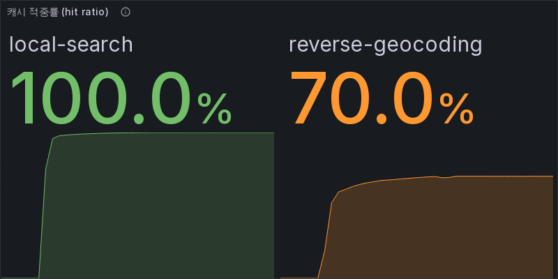

# Case Study — 지도 API 캐시가 가리고 있던 것

> **한 줄 요약** — Redis를 넣기 전에 기존 로컬 캐시가 실제로 효과가 있는지 측정했습니다. 효과는 확실했지만(8.2초 → 8.3ms), 동시에 **캐시가 진짜 문제를 가리고 있다는 것**을 발견했습니다. 지도 뷰포트 1회 요청이 외부 API를 41번 부르고 있었습니다.

| | |
|---|---|
| **기간** | 2026-08-14 |
| **범위** | Backend — `NaverApiClient` 로컬 캐시 |
| **결과** | 반복 조회 외부 호출 **820 → 0회**, avg **8,202ms → 8.3ms** |
| **증거** | [측정 원자료](../evidence/2026-08-14-map-cache.md) · `NaverApiCacheTest` (5) |

---

## Problem

포트폴리오에 "Redis 분산 캐시"를 넣을까 고민했습니다. 그런데 넣기 전에 답해야 할 질문이 있었습니다.

> **지금 있는 캐시는 실제로 효과가 있는가?**

측정하지 않은 채 Redis를 얹으면, 있는지도 모르는 문제에 도구를 붙이는 셈입니다.

현재 캐시는 `NaverApiClient` 안의 `ConcurrentHashMap` + TTL 2분입니다.
**Caffeine도 Redis도 아닙니다.** 이력서에 그렇게 쓰지 않으려면 실체를 먼저 확인해야 했습니다.

---

## Analyze / Constraints

**측정의 가장 큰 걸림돌은 "외부 API 호출 횟수를 어떻게 세는가"였습니다.**

실제 네이버 API를 쓰면
- 호출 수를 셀 방법이 없고
- 쿼터와 요금이 걸리고
- 응답 내용이 그때그때 달라 측정이 흔들립니다

그래서 같은 자리에 **호출 수를 세는 스텁 서버**를 두었습니다.
`GET /__stats`로 누적 횟수를 읽고 `POST /__reset`으로 초기화합니다.

**두 번째 걸림돌은 캐시를 끌 방법이 없다는 것이었습니다.**
TTL이 `private static final` 상수라 ON/OFF 비교를 하려면 코드를 고쳐 두 번 빌드해야 했습니다.
그러면 "같은 빌드로 비교했는가"라는 질문이 남습니다.

→ TTL을 설정값으로 뺐습니다(`naver.cache.ttl-seconds`, 0이면 비활성).
**같은 빌드에서 환경변수만 바꿔 비교**할 수 있고, 운영에서 외부 응답이 이상할 때 즉시 우회할 수도 있습니다.

---

## Options

측정 방법을 두 가지로 나눴습니다. **하나만으로는 부족했기 때문입니다.**

| 방법 | 얻는 것 | 못 얻는 것 |
|---|---|---|
| 단위 테스트 (가짜 RestTemplate) | hit/miss 정확한 횟수, TTL 만료, key 식별 규칙 | 실제 응답시간 |
| HTTP 측정 (스텁 서버 + 반복 요청) | avg/p95, 실제 외부 호출 수 | TTL 2분을 기다려야 함 |

**둘 다 했습니다.** TTL 만료는 단위 테스트에서 저장 시각을 과거로 밀어 확인하고,
응답시간은 HTTP에서 쟀습니다.

---

## Action

### 1. TTL을 설정으로 분리

```java
@Value("${naver.cache.ttl-seconds:120}")
private long cacheTtlSeconds;   // 0이면 캐시 비활성
```

### 2. 호출 수를 세는 네이버 스텁

`tools/performance/naver-stub/stub.py` — Local Search와 Reverse Geocode 응답을 흉내내고
경로별 호출 수를 셉니다. `--latency-ms`로 외부 지연도 흉내낼 수 있습니다.

### 3. 캐시 동작을 테스트로 고정

`NaverApiCacheTest` (5개) — 같은 검색 반복 시 외부 호출 1회, 캐시 OFF 시 매번 호출,
파라미터가 하나만 달라도 별도 항목, TTL 만료 후 재조회, 만료 항목은 읽을 때만 정리.

---

## Result

### 캐시는 확실히 효과가 있다

같은 뷰포트를 20회 반복 조회:

| | 캐시 OFF | 캐시 ON |
|---|---:|---:|
| 외부 API 호출 | **820회** | **0회** |
| avg | **8,202ms** | **8.3ms** |
| p95 | 8,218ms | 12.6ms |

### 그런데 첫 조회는 캐시가 있어도 7.3초다

| | 시간 | 외부 호출 |
|---|---:|---:|
| cold (첫 요청) | **7,320ms** | 37 |
| warm (이후) | 8.3ms | 0 |

**캐시는 반복을 없앨 뿐 첫 요청을 빠르게 만들지 않습니다.**
사용자가 처음 지도를 열면 여전히 7초를 기다립니다. TTL이 2분이니 **2분마다 한 번은 그 비용을 냅니다.**

### 진짜 문제 — 뷰포트 1회에 외부 API 41번

캐시를 끄고 딱 한 번 요청했을 때:

```
Reverse Geocode   1회   중심 좌표 → "강남구 역삼동"
Local Search     40회   키워드 10개 × 최대 4페이지
─────────────────────
                 41회
```

그리고 **응답시간의 정체**를 알아냈습니다.

```
41회 × 200ms = 8,200ms      측정된 avg 8,202ms
```

느린 이유는 네트워크가 아니라 코드에 하드코딩된 레이트 리미터(`MIN_INTERVAL_MS = 200`)였습니다.
스텁의 50ms 지연은 그 안에 묻혀 보이지도 않습니다.

### 캐시가 가리고 있던 버그

cold 요청이 41회가 아니라 **37회**였습니다. 4회가 어디 갔는지 추적했습니다.

```java
for (String base : KEYWORDS) {                  // KEYWORDS[0] == "포토부스"
    searchKeywords.add(regionName + " " + base);
}
searchKeywords.add(regionName + " 포토부스");    // ← 같은 키워드를 한 번 더
```

`"강남구 역삼동 포토부스"`가 두 번 만들어집니다. 페이지 4개 × 중복 1개 = 4회.
**캐시가 켜져 있으면 두 번째는 전부 hit이라 아무도 눈치채지 못합니다.**

캐시를 끄자 드러났습니다.

---

## Limit / Next Condition

### 메모리에 상한이 없다

`ConcurrentHashMap`에 크기 제한이 없고, 만료 정리는 **읽을 때만** 일어납니다.
다시 조회되지 않는 항목은 TTL이 지나도 남습니다.

증가 경로 두 가지의 성질이 다릅니다.

| key | 증가 요인 | 위험 |
|---|---|---|
| Local Search | 지역명 기준 | 같은 동네면 재사용됨 |
| Reverse Geocode | **좌표 그 자체** | 지도를 1m만 움직여도 새 항목 |

실제로 서로 다른 뷰포트 3곳을 조회했을 때 Local Search는 0회(같은 지역이라 전부 hit),
Reverse Geocode는 좌표가 달라 매번 새 항목이 됐습니다.

서울 행정동만 약 467개. Local Search만 467 × 40 = 약 18,700개 항목이 가능하고,
Reverse Geocode는 사용자가 지도를 움직이는 만큼 **무한히** 늘어납니다.

→ 좌표를 소수점 3자리(약 100m)로 반올림하면 증가가 멈춥니다.
→ **크기 상한과 LRU가 필요할 때가 Caffeine을 도입할 시점입니다.** 지금은 그 근거가 아직 없습니다.

### stale data

TTL 2분 동안 옛 응답을 돌려줍니다. 폐업한 매장이 최대 2분간 지도에 남습니다.
포토부스 정보는 분 단위로 바뀌지 않으므로 현재 도메인에서는 감수할 만합니다.

### 다중 인스턴스

인스턴스마다 별도 Map입니다. 서버가 2대면 같은 지역 첫 요청을 각각 겪고, 재시작하면 전부 사라집니다.
**지금은 단일 인스턴스라 문제가 되지 않습니다.** 인스턴스를 늘릴 때가 Redis를 검토할 시점입니다.

### 그래서 Redis는?

**넣지 않았습니다.** 넣을 근거가 아직 없습니다.

우선순위는 이쪽입니다.

| 순위 | 할 일 | 기대 |
|---|---|---|
| 1 | 중복 키워드 제거 | 41 → 37회 |
| 2 | 키워드·페이지 수 재검토 (정말 10×4가 필요한가) | 대폭 감소 |
| 3 | 좌표 반올림으로 Reverse Geocode key 안정화 | 메모리 증가 차단 |
| 4 | 크기 상한 + LRU | Caffeine 도입 근거 |
| 5 | 다중 인스턴스가 될 때 Redis | 지금은 근거 없음 |

**캐시를 더 좋게 만들기 전에 캐시가 필요 없게 만드는 것이 먼저입니다.**

---

## 후속 조치 — 중복 키워드 제거 (2026-08-15)

측정으로 드러난 중복을 실제로 제거했습니다.

```java
// 전: KEYWORDS[0]이 "포토부스"인데 보조 키워드로 "지역명 + 포토부스"를 또 넣었다
List<String> searchKeywords = new ArrayList<>();
for (String base : KEYWORDS) searchKeywords.add(regionName + " " + base);
searchKeywords.add(regionName + " 포토부스");        // ← 중복

// 후: 집합으로 받아 중복이 구조적으로 불가능하게
Set<String> keywordSet = new LinkedHashSet<>();      // 순서는 유지
```

`distinct()` 한 번이 아니라 **집합으로 받은 이유**는, 앞으로 키워드를 추가하다
겹쳐도 자동으로 걸러지게 하기 위함입니다. `/search` 경로의 같은 중복
(`BRANDS[0]`도 `"포토부스"`)도 함께 고쳤습니다.

### 측정 (같은 세션·같은 스텁, 캐시 OFF, 각 3회)

| 항목 | Before | After | 변화 |
|---|---:|---:|---|
| 뷰포트 1회 외부 API 호출 | **41회** | **37회** | **-9.8%** |
| 사용된 검색어 수 | 10개 | **9개** | 중복 1개 제거 |
| 응답시간 평균 | 7,954ms | **7,139ms** | **-815ms (-10.2%)** |

응답시간 감소가 호출 감소와 거의 정확히 비례합니다 — `4회 × 200ms = 800ms`.
**레이트 리미터가 병목이라는 진단이 여기서 다시 확인됩니다.**

> `/search` 경로는 호출 수가 5회로 그대로였습니다.
> `raw.size() >= max * 2`에서 조기 종료가 걸려 중복이 호출 수에 드러나지 않기 때문입니다.
> 그래도 고친 이유는, 조기 종료 조건이 바뀌면 그때 중복이 살아나기 때문입니다.

`PhotoboothKeywordDedupTest`로 고정했습니다. 수정 전 코드로 돌리면
**40회를 기록하며 실패**합니다.

## 후속 조치 2 — 실제 API로 측정하니 페이지네이션이 무의미했다 (2026-08-15)

"페이지 2~4가 결과를 얼마나 더 주는가"는 스텁으로 답할 수 없어 **실제 네이버 API 키를 붙여**
측정했습니다. 그러자 두 가지가 한꺼번에 드러났습니다.

### 발견 ① — 지도 기능이 이미 동작하지 않는 상태였다

```
구 경로 + X-Naver-Client-*  → 401 "NID AUTH Result Invalid"
HUB 경로 + X-NCP-APIGW-*    → 200
```

2026년 네이버 검색 API가 **NAVER API HUB로 이관**됐습니다.
NCP에서 새로 발급한 키는 구 경로(`openapi.naver.com/v1/search/local.json`)를 통과하지 못합니다.

| | 코드가 보내던 것 | 실제 필요한 것 |
|---|---|---|
| 엔드포인트 | `openapi.naver.com/v1/search/local.json` | `naverapihub.apigw.ntruss.com/search/v1/local` |
| 인증 헤더 | `X-Naver-Client-Id/Secret` | `X-NCP-APIGW-API-KEY-ID/KEY` |

역지오코딩은 이미 NCP 방식이라 정상이었습니다. **지역 검색만 이관을 못 따라간 상태**였습니다.

### 발견 ② — `start` 파라미터가 무시된다

같은 검색어로 `start`만 바꿔 4번 불러봤습니다.

```
start=1  → 응답 start=1, 5건
start=6  → 응답 start=1, 5건   ← 동일한 5건
start=11 → 응답 start=1, 5건   ← 동일한 5건
start=16 → 응답 start=1, 5건   ← 동일한 5건
```

**items가 완전히 같습니다.** `display`도 5가 상한이라 한 번에 더 받을 수도 없습니다.

키워드 9개로 4페이지씩 돌린 결과:

| 페이지 | 신규 장소(전체) | 신규 장소(뷰포트 내) |
|---:|---:|---:|
| 1 | 30곳 | 1곳 |
| 2 | **0곳** | **0곳** |
| 3 | **0곳** | **0곳** |
| 4 | **0곳** | **0곳** |

**페이지 2~4가 준 새 정보는 0입니다.** 같은 응답을 최대 4번 받으려고 호출만 4배 쓰고 있었습니다.
캐시가 켜져 있으면 2~4번째는 전부 hit이라 이 낭비도 드러나지 않았습니다.

### 측정 — 실제 네이버 API, 같은 세션, 캐시 OFF, 각 3회

| 항목 | Before | After | 변화 |
|---|---:|---:|---|
| 외부 API 호출 (뷰포트 1회) | **25회** | **10회** | **-60%** |
| ├ Local Search | 24회 | 9회 | |
| └ Reverse Geocode | 1회 | 1회 | |
| 수집한 raw 항목 | 107건 | 32건 | -70% |
| **뷰포트 내 결과** | **1건** | **1건** | **동일** |
| 응답시간 평균 | **4,770ms** | **1,857ms** | **-2,913ms (-61.1%)** |

**결과는 그대로인데 호출과 시간이 60% 줄었습니다.**
버린 15회는 전부 같은 응답을 다시 받는 호출이었습니다.

> Before가 41회가 아니라 25회인 이유: 실제 API에서는 결과가 5건 미만인 키워드가 있어
> 페이지 루프가 조기 종료됩니다(`items.size() < PAGE_SIZE`). 41은 **최대치**이고
> 실측 최댓값은 25였습니다. 스텁은 항상 5건을 줘서 41이 나왔던 것입니다.

### 남은 것

10회 중 9회가 키워드 검색입니다. 더 줄이려면 **키워드 9개가 다 필요한지**를 봐야 하는데,
이번 측정에서 뷰포트 안 결과를 준 키워드는 `포토부스` 하나뿐이었습니다(4곳 중 1곳이 뷰포트 내).
다만 지역·시간대에 따라 다를 수 있어 **여러 지역에서 반복 측정한 뒤** 판단해야 합니다.

---

## Evidence

| 항목 | 위치 |
|---|---|
| 측정 원자료 | [`docs/evidence/2026-08-14-map-cache.md`](../evidence/2026-08-14-map-cache.md) |
| 캐시 동작 테스트 | `NaverApiCacheTest` (5) |
| 중복 제거 회귀 테스트 | `PhotoboothKeywordDedupTest` |
| 측정용 스텁 | `tools/performance/naver-stub/stub.py` |

```bash
cd backend && ./gradlew test --tests '*NaverApiCacheTest*'
```


---

## 후속 조치 3 — 하나의 캐시를 데이터 성격에 따라 둘로 나눴다 (2026-08-20)

### 문제 — 두 데이터의 TTL이 같았다

캐시 하나에 서로 다른 두 종류의 응답이 같이 들어 있었습니다.

| | Local Search | Reverse Geocoding |
|---|---|---|
| 담는 것 | 업체 검색 결과 | 좌표 → 행정구역 |
| 바뀌는 이유 | 폐업·신규 오픈·정보 수정 | 행정구역 개편 |
| 바뀌는 빈도 | 가끔 | 거의 없음 |

그런데 **둘 다 TTL 120초**였습니다. 하나의 값으로는 한쪽에 맞추면 다른 쪽이 손해입니다.
게다가 통계가 없어서 **어느 쪽이 외부 호출 비용을 쓰는지 구분조차 되지 않았습니다.**

구현도 `ConcurrentHashMap` + 저장 시각 수동 비교였습니다.
크기 상한이 없었고, 만료 정리가 **읽을 때만** 일어나서 다시 읽히지 않는 항목은 계속 남았습니다.

### 선택 — Caffeine 캐시 2개로 분리

| | local-search | reverse-geocoding |
|---|---|---|
| 만료 | `expireAfterWrite` **5분** | `expireAfterWrite` **30분** |
| 크기 상한 | `maximumSize` 1000 entry | `maximumSize` 1000 entry |
| 통계 | `recordStats()` | `recordStats()` |
| 개별 OFF | `ttl-seconds: 0` | `ttl-seconds: 0` |

key는 예전과 같은 **요청 URI 문자열**입니다. 바꾼 것은 "어디에 얼마나 담느냐"뿐입니다.

`expireAfterAccess`는 쓰지 않았습니다. 읽을 때마다 수명이 연장되면
**자주 보는 지역의 오래된 응답이 계속 살아남기** 때문입니다.
버릴지 말지는 "얼마나 자주 읽히는가"가 아니라 "얼마나 오래됐는가"로 정해야 합니다.

### 검증 — 성능이 아니라 정책을 확인했다

동일 요청 10회, 로컬 스텁, 조건마다 앱 재시작:

| 조건 | local TTL | reverse TTL | 외부 Local | 외부 Reverse | 총 |
|---|---:|---:|---:|---:|---:|
| Local 캐시 OFF | 0 | 1800 | **90** | 1 | 91 |
| 둘 다 ON | 300 | 1800 | **9** | 1 | **10** |
| Reverse 캐시 OFF | 300 | 0 | 9 | **10** | 19 |

**한쪽을 꺼도 다른 쪽이 그대로 동작합니다.** 이게 분리의 핵심입니다.

> ⚠️ **"TTL을 120초에서 300초로 늘려 빨라졌다"고 말하지 않습니다.**
> TTL별 성능 비교를 하지 않았습니다. 5분/30분은 데이터 특성으로 정한 **초기값**이고,
> 운영 지표를 보고 조정할 값입니다.

### 관측 — Grafana에서 실제로 보인다

`recordStats()`만으로는 테스트에서만 값을 볼 수 있습니다.
그러면 "캐시를 넣었다"까지만 증명되고, **정책이 맞는지는 알 수 없습니다.**
Micrometer에 붙여 Prometheus로 내보냈습니다.



- `local-search` **100%** — 같은 지역이면 검색어가 같아 항상 적중
- `reverse-geocoding` **70%** — 좌표가 곧 키라서 지도를 움직이면 새 키가 생김

**두 캐시가 다르게 동작한다는 것이 숫자로 보입니다.**
하나의 Map이었다면 이 둘은 섞여 하나의 값이 되고, 어느 쪽이 문제인지 알 수 없었습니다.

측정 원자료와 한계: [2026-08-20 지도 캐시 분리와 TTL 정책 검증](../evidence/2026-08-20-map-cache-split.md)
