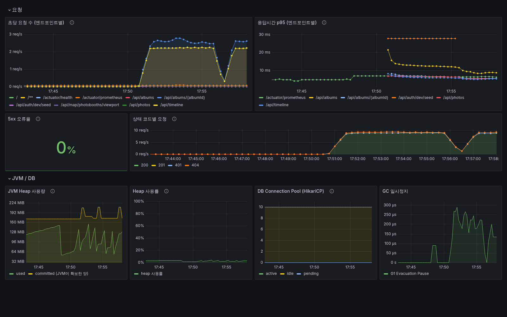
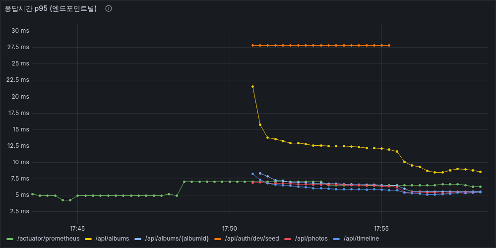
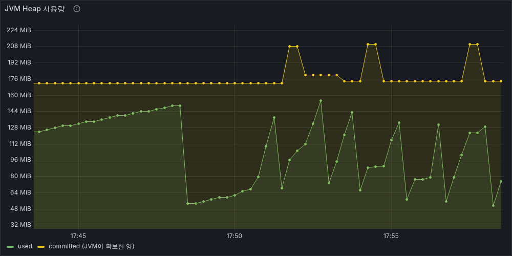
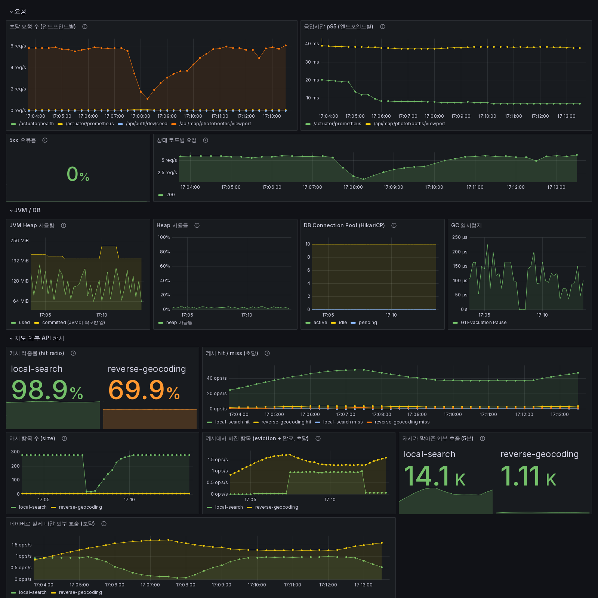
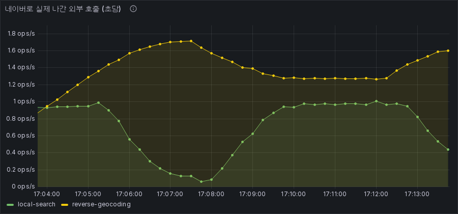
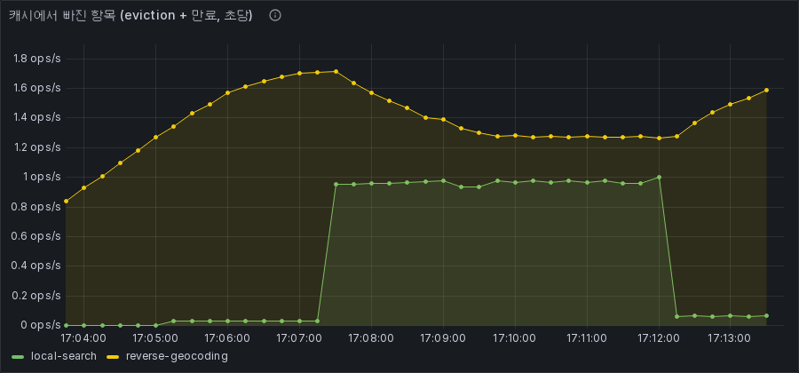

# Grafana 대시보드 화면

**촬영일:** 2026-08-15 (지도 캐시 패널은 2026-08-20)
**대시보드:** `infra/monitoring/grafana/dashboards/nemo-backend.json`

Grafana Image Renderer로 자동 생성했습니다. 손으로 캡처한 것이 아니라
**대시보드 정의에서 그대로 렌더링**한 것이라, JSON을 고치면 같은 명령으로 다시 뽑을 수 있습니다.

---

## 전체 대시보드



부하를 준 구간(약 17:51~)과 잠깐 멈춘 구간(17:56)이 **모든 패널에 동시에** 나타납니다.
요청 수가 뛰고 → p95가 따라 오르고 → GC가 함께 튀는 것이 한 화면에서 보입니다.
이게 지표를 따로따로 `curl`로 읽는 것과 다른 점입니다.

읽을 거리:

- **초당 요청 수** — 엔드포인트 9개가 구분됩니다. 0 → 2.5 req/s
- **응답시간 p95** — `NaN` 없이 실제 값만. 트래픽 없는 엔드포인트는 자동으로 빠집니다
- **5xx 오류율** — `0%` 초록. **「No data」가 아닙니다** (아래 참고)
- **상태 코드별** — 200 / 201 / 401 / 404가 분리됩니다
- **GC 일시정지** — 부하 구간에만 톱니가 생깁니다

---

## 응답시간 p95 (엔드포인트별)



느린 API를 찾는 핵심 패널입니다. 평균은 소수의 느린 요청을 감춥니다.

처음에는 트래픽이 없는 엔드포인트까지 전부 `NaN`으로 계산돼 범례를 채웠고,
**정작 느린 API가 그 안에 묻혔습니다.** 요청이 실제로 있는 것만 남기도록 고쳤습니다.

```promql
histogram_quantile(0.95, sum by (le, uri) (rate(http_server_requests_seconds_bucket[5m])))
  and on (uri) (sum by (uri) (rate(http_server_requests_seconds_count[5m])) > 0)
```

---

## JVM Heap 사용량



처음에는 `used`와 `max`를 같이 그렸습니다. `max`가 4 GiB인데 `used`는 150 MB라
**used가 바닥에 붙은 평평한 선**이 되어 메모리가 새는지 판단할 수 없었습니다.

`max` 대신 **`committed`**(JVM이 실제로 확보한 양)를 넣었습니다.
150MB vs 182MB로 같은 스케일이라 **GC 톱니와 확보량 증가가 함께 보입니다.**
한계 대비 여유는 옆의 `Heap 사용률` 패널(`used / max`)이 담당합니다.

---

## 지도 외부 API 캐시 (2026-08-20 추가, 실제 NAVER API 기준)



맨 아래 「지도 외부 API 캐시」 행이 새로 붙은 부분입니다.
Local Search와 Reverse Geocoding 캐시를 분리하면서, 각각의 hit/miss·size·eviction을
Micrometer로 내보내 Grafana에서 따로 보게 했습니다.

### 캐시 적중률


**두 캐시가 다르게 동작하는 것이 한눈에 보입니다.**

- `local-search` **98.9%** — 지도를 옮겨도 지역명이 같으면 검색어가 같아 적중합니다
- `reverse-geocoding` **69.9%** — 좌표가 곧 캐시 키라서, 지도를 움직이면 매번 새 키가 됩니다

이 차이가 캐시를 나눈 이유 그 자체입니다.
하나의 Map이었다면 두 숫자가 섞여 하나가 되고, 어느 쪽이 문제인지 알 수 없었습니다.

### 네이버로 실제 나간 외부 호출



적중률만으로는 부족합니다. **비용은 "밖으로 몇 번 나갔는가"** 에서 발생합니다.
적중률 98.9%인 `local-search`가 실제 호출은 더 적고,
69.9%인 `reverse-geocoding`이 더 많이 나가는 것이 여기서 드러납니다.
캐시를 끄면 적중률 지표 자체가 사라지므로, 이 패널이 있어야 ON/OFF를 같은 잣대로 비교할 수 있습니다.

### 캐시에서 빠진 항목



이 화면은 **`reverse-geocoding`의 `maximum-size`를 일부러 5로 좁혀** 축출을 보이게 만든 것입니다.
기본값 1000에서는 이 정도 부하로 상한에 닿지 않습니다.

> **여기서 하나 배웠습니다.** 처음에는 이 패널을 "maximumSize에 눌려 밀려난 수"로 설명했는데,
> 실제로 돌려보니 상한에 한참 못 미치는 `local-search`에도 값이 잡혔습니다.
> Caffeine의 `evictionCount()`는 **TTL 만료로 빠진 것도 함께 셉니다.**
> 그래서 패널 이름을 「캐시에서 빠진 항목 (eviction + 만료)」로 고쳤습니다.
> **대시보드를 실제로 띄워보지 않았으면 틀린 설명을 그대로 뒀을 것입니다.**

측정 조건과 한계: [2026-08-20 지도 캐시 분리와 TTL 정책 검증](../2026-08-20-map-cache-split.md)

---

## 다시 뽑는 방법

```bash
# 모니터링 스택
docker compose --profile monitoring up -d

# 이미지 렌더러 (스크린샷을 다시 만들 때만 필요)
docker run -d --name renderer --network <net> grafana/grafana-image-renderer
# Grafana에 GF_RENDERING_SERVER_URL=http://renderer:8081/render 지정

curl -u admin:admin -o grafana-dashboard.png \
  "http://localhost:3000/render/d/nemo-backend/nemo-backend?orgId=1&from=now-15m&to=now&width=1600&height=1000&kiosk=1"
```

패널 하나만 뽑을 때는 `/render/d-solo/...&panelId=<id>`를 씁니다.

---

## 이 화면의 한계

- **부하가 낮은 상태입니다.** 로컬에서 초당 2~3 요청 수준이고, 실제 트래픽 패턴이 아닙니다.
- 그래서 **임계값(p95 0.5s/2s, heap 70%/90%)이 적절한지는 아직 모릅니다.**
- 알림 규칙은 설정하지 않았습니다.

관련: [CS 06 — 지표를 붙이고 나서 알게 된 것](../../case-studies/06-monitoring.md)
